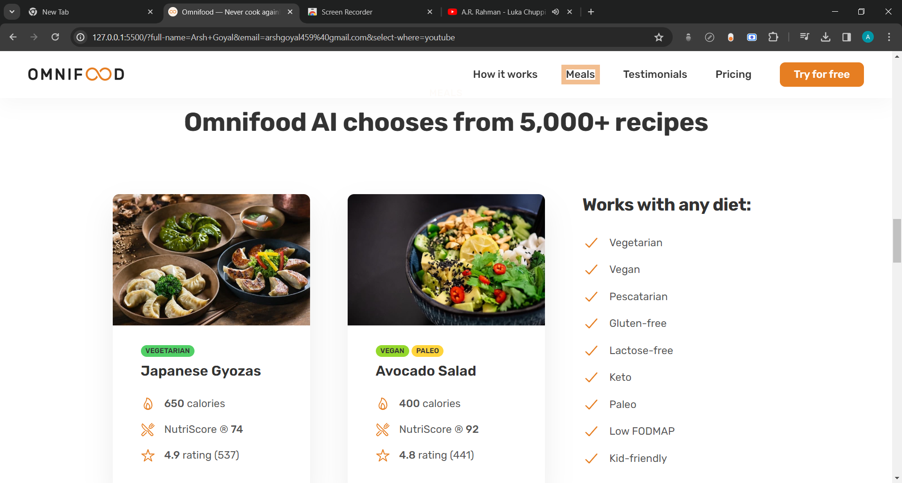
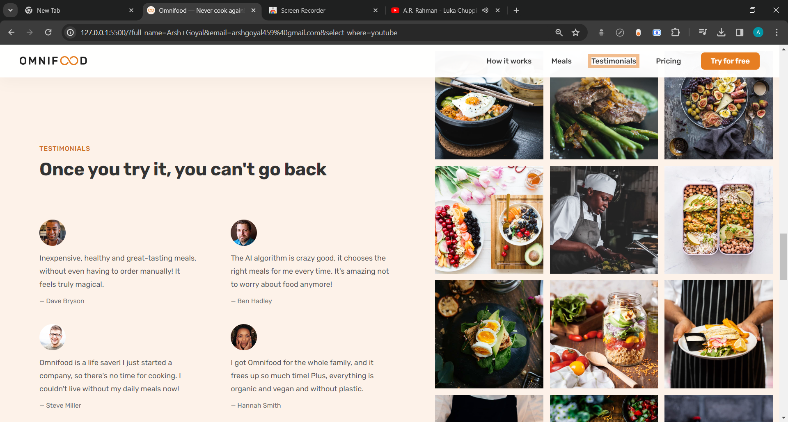

# Omnifood-app

It is a food meal delivery app. It is based on a subscription model.
Click on this :- [Deployed Link](https://omnifood-goyal.netlify.app/)

## Table of Contents

- [Project Overview](#project-overview)
- [Getting Started](#getting-started)
  - [Prerequisites](#prerequisites)
  - [Installation](#installation)

## Project Overview

### Key Features

- Mobile first responsive design.
- Internal Navigation between sections.
- Smooth Scrolling through vanilla javaScript.
- Modular and Clean Code.

### Technologies Used

- HTML, CSS, JavaScript
- Git, Netlify

### Demo Video

Click to play demo Video:- [https://youtu.be/NMtRnkfo_GE](https://youtu.be/NMtRnkfo_GE)

### Screenshots

- Hero Section

- How it Works Section

- Meals Section

- Testimonials Section

- Form Section - Connected to netlify forms

